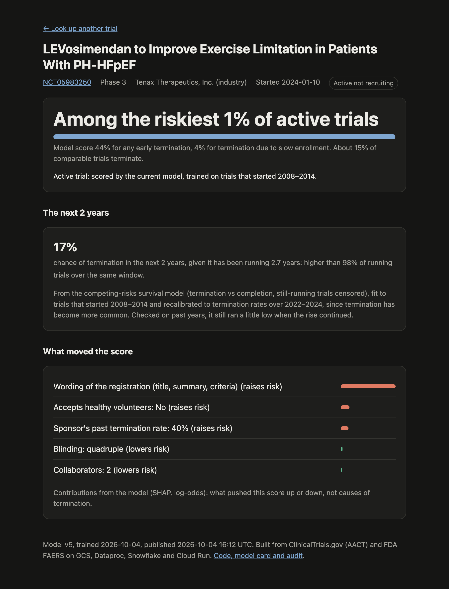
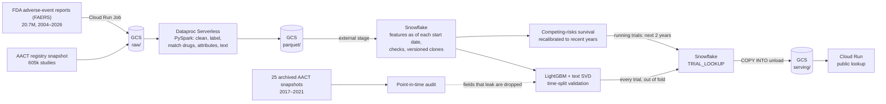

# Clinical Trial Risk Pipeline

Which drug trials will be stopped early, and when? This pipeline scores every Phase 1–3 drug trial on ClinicalTrials.gov for its risk of termination. It uses only what was known when each trial started: the registry record, the sponsor's track record and the drug's FDA adverse-event (FAERS) history. It is checked against the registry as it stood at each trial's start, and it is live.

**Try it:** [ctrisk-lookup-420431563670.us-east1.run.app](https://ctrisk-lookup-420431563670.us-east1.run.app). Look up any of 111,118 trials by NCT ID, e.g. [NCT02868892](https://ctrisk-lookup-420431563670.us-east1.run.app/trial/NCT02868892), a 2015 cervical-cancer trial that was terminated: it started in the held-out test years, and the model ranks it riskier than 99% of active trials. JSON: `/api/trials/{nct_id}`.

<p align="center"></p>

## At a glance

**Results** (held-out trials the model never saw):
- **0.708 ROC AUC** (95% CI 0.696–0.721) on 10,242 trials that started 2015–2016. The top-scored 10% terminate at 2.1× the base rate (30.4% vs 14.8%). For terminations caused by slow enrollment, the AUC is 0.780.
- **No leak:** registry records get edited after trials start, which can leak the outcome. Rebuilt from 25 archived registry snapshots as each record stood at its trial's start, the model loses no accuracy (+0.003, 95% CI 0.000 to +0.005, 18,568 trials). Getting there meant dropping four fields that did leak.
- **When, not just whether:** a competing-risks survival model, using the ~30,000 still-running trials as censored data, ranks terminations within 2 years better than the yes/no model (time-AUC 0.644 vs 0.586 on 2017–2020 starts; gain +0.043 to +0.073).
- **Termination is rising:** censoring-adjusted, trials that started 2019–20 were terminated within 2 years 45% more often than 2013–14 starts (7.4% vs 5.1%). The served survival model is recalibrated for it, and the recalibration is backtested on past years.

**What runs where:**

| Step | Platform | Scale | Time · cost |
|---|---|---|---|
| Copy the full FAERS history from openFDA | Cloud Run Job, 24 parallel tasks | 1,767 files, 118 GB | 3 min 45 s · ≈ $0.10 |
| Clean, label, match drugs to FDA substances, flatten FAERS | PySpark on Dataproc Serverless (same code runs locally in tests) | 605k studies, 20.7M reports → 73M rows | all jobs ≈ $1.10; full FAERS flatten 1 h 51 min · $3.46 |
| Data lake: raw files, Spark output, served file | Cloud Storage | ≈ 130 GB | ≈ $3 / month |
| Features as of each trial's start date, data checks, a zero-copy clone per model version, every score stored | Snowflake (X-Small, auto-suspend 60 s) | 111,118 trials | seconds per build |
| Models: LightGBM + TF-IDF text, competing-risks hazards, SHAP reasons | Python (laptop) | 36k training trials | minutes |
| Public lookup | FastAPI on Cloud Run, scales to zero; reads a file Snowflake unloads to GCS, never Snowflake per visit | 111,118 trials | ≈ free |

**What didn't work (each one measured and written up):**
- **Biomedical text embeddings** (PubMedBERT, 768-d) instead of or alongside TF-IDF: no gain (0.708 vs 0.709 for TF-IDF alone). The signal is lexical. [Experiment](docs/experiments/2026-10-03-text-embeddings.md).
- **The full 20.7 million FDA adverse-event reports** instead of a 3.2M sample: no gain; FAERS adds about 0.001 AUC either way. Served anyway, because the features are now current. [Experiment](docs/experiments/2026-10-04-full-faers.md).
- **The best-scoring model (v3, 0.714)** was rejected: the point-in-time audit showed four of its fields were edited after start more often for trials that later terminated. [Audit](docs/audits/2026-10-01-point-in-time.md).
- **The survival model's raw probabilities** ran low for recent trials, and too spread out. Recalibrated on recent calendar time; backtested, it still runs a little low when the rise continues ([below](#when-not-just-whether-a-competing-risks-survival-model)).

Full validation report: [`docs/model_card.md`](docs/model_card.md) · Survival model: [`docs/survival_card.md`](docs/survival_card.md) · Audit: [`docs/audits/2026-10-01-point-in-time.md`](docs/audits/2026-10-01-point-in-time.md) · Dashboard: [`docs/dashboard/index.html`](docs/dashboard/index.html) · Design: [`docs/specs/2026-09-26-design.md`](docs/specs/2026-09-26-design.md)

## How it works



- **Data:** the AACT flat-file snapshot of ClinicalTrials.gov (2026-09-26) and the full FAERS history (every quarter 2004–2026), both landed in GCS.
- **Spark on Dataproc Serverless:** the same PySpark modules run locally for tests or as serverless batches (`make <job> MODE=cloud`), each with an executor cap and a TTL. They clean and label the trials, flatten FAERS, match each drug to FDA-coded substances (72.0% of labeled trials matched; spot checks against openFDA agree), and build per-trial attributes and a registration-text field. Snowflake rebuilt from the Dataproc output is identical to the locally built data: 111,118 rows, 0 differences.
- **Snowflake:** loads the Parquet from GCS. Builds the FAERS and sponsor-history features as of each trial's start date only, with tests that catch planted leakage.
- **Model:** LightGBM on the tabular features plus 64 SVD components of TF-IDF text. Tuned on an inner time split of the training years. Every model is versioned (`models/vN/`) with its metrics, features and the Snowflake clone it was trained on.
- **Serving:** every trial in the modelled population gets a score that never used its own outcome:
  - active trials: the final model
  - trials that started 2015 or later: held out from training
  - 2008–2014 trials: leave-one-start-year-out cross-fitting (their scores average 13.4% vs a 13.9% actual termination rate)

  Snowflake joins the scores to trial details (`TRIAL_LOOKUP`) and unloads them to GCS with `COPY INTO`. A FastAPI app on Cloud Run loads that file at startup, so it scales to zero and never queries Snowflake per visitor. Active-trial scores are also appended to `TRIAL_RISK_SCORES` for the prospective backtest. A one-file dashboard and a model card are generated from the saved metrics.

## Results (model v5: trained on 2008–2014 starts, tested on 2015–2016)

| Target | Test ROC AUC (95% CI) | Logistic baseline | Top-10% precision vs base rate |
|---|---|---|---|
| Any termination | **0.708** (0.696–0.721) | 0.672 | 30.4% vs 14.8% (2.1×) |
| Terminated for enrollment | **0.780** (0.761–0.798) | 0.756 | 16.5% vs 5.1% (3.2×) |
| Terminated for safety | 0.675 (0.618–0.730) | 0.676 | 87 test positives: too few to be conclusive |

**What drives the scores** (mean SHAP contribution on the test set): the registration text, then whether the trial accepts healthy volunteers (No raises risk, Yes lowers it), the sponsor's prior termination rate (high third +0.24, low third −0.18 log-odds), and phase (Phase 2 up, Phase 1 and 3 down). These describe the model, not causes of termination. Text adds +0.012 AUC; FAERS history about 0.001.

**v3 vs v4.** v3 also used criteria count and length, country count and US-only. It scored higher on the test years (0.714, 95% CI 0.700–0.726), but the audit showed those fields had changed after start more often for trials that later terminated. v3 lost 0.005 AUC when scored on the at-start records; v4 loses nothing. v4 trades 0.011 of headline AUC for a number that holds up: those fields carried real signal as well as the leak. **v5** is v4 with the full FAERS history instead of a Q1 sample: equivalent accuracy (v5 minus v4 −0.000 to +0.010, paired bootstrap), but current data: v4's adverse-event features stopped at 2020, so most of today's active trials were scored on frozen counts.

### When, not just whether: a competing-risks survival model

The yes/no model learns only from finished trials and cannot say when a trial will stop. The survival model (M8) does both:
- **Outcomes:** a trial ends terminated or completed (competing events), or is still running at the snapshot (censored), so the ~30,000 running trials inform the model instead of being dropped.
- **Model:** discrete-time hazards, one row per 6-month period a trial was at risk, from LightGBM on the same features and text.
- **Output:** the probability of termination within t years of the start. For a running trial: within the next 2 years, given how long it has already run. That's the number the [lookup](https://ctrisk-lookup-420431563670.us-east1.run.app) shows.

It's evaluated with metrics built for censored data. Time-dependent AUC asks whether trials terminated by t rank above those still running or completed by t, weighted by the inverse probability of censoring:

| Ranking terminations by t (time-AUC) | Within 1 year | Within 2 years (95% CI) | Within 5 years |
|---|---|---|---|
| Survival model, 2015–16 starts | 0.652 | 0.642 (0.621–0.666) | 0.683 |
| Yes/no model v5, same trials | 0.554 | 0.622 | 0.681 |
| Survival model, 2017–20 starts (13% still running) | 0.628 | 0.644 (0.630–0.658) | 0.662 |
| Yes/no model v5, same trials | 0.529 | 0.586 | 0.648 |

The gain is clearest for early terminations (1 year: 0.65 vs 0.55) and on the censored 2017–20 cohort, where the yes/no model's finished-trials-only view is most biased: at 2 years +0.043 to +0.073 (paired bootstrap). On 2015–16 starts the 2-year gain is about +0.02 and not significant (−0.005 to +0.044). Three fits that differed only in row order all agree on this. Training now reads rows in a fixed order, so reruns reproduce. Censoring-adjusted termination within 2 years, by start years:

| 2008–10 | 2011–12 | 2013–14 | 2015–16 | 2017–18 | 2019–20 |
|---|---|---|---|---|---|
| 6.3% | 5.2% | 5.1% | 5.7% | 6.0% | **7.4%** |

Termination fell through the early 2010s and has risen since: trials that started in 2019–20 (the COVID era) were terminated within 2 years about 45% more often than 2013–14 starts. The binary approach could not measure this, because it cannot adjust for trials still running.

**Recalibrated for today, and backtested.** Learned from 2008–2014 starts, the raw probabilities run low for trials running now, and too spread out. Since 2020, trials of every start year have been terminated 18–29% more often than the model expected. So the per-period odds of termination are recalibrated (intercept and slope, by maximum likelihood) on calendar 2022–2024. The newest 1.7 years are skipped, because completions fall short there too: sponsors record endings late. The backtest repeats this at five past dates for the trials then running, recalibrating only on what was known 1.7 years earlier:

| Trials running at | 2019-01 | 2020-01 | 2021-01 | 2022-01 | 2023-01 |
|---|---|---|---|---|---|
| Terminated in the next 2 years | 8.1% | 8.8% | 9.2% | 10.0% | 10.3% |
| Predicted, raw | 7.6% | 7.7% | 7.6% | 7.5% | 7.5% |
| Predicted, recalibrated | 7.8% | 8.4% | 8.3% | 8.2% | 8.4% |
| Time-AUC (yes/no model) | 0.592 (0.562) | 0.583 (0.536) | 0.602 (0.562) | 0.595 (0.553) | 0.594 (0.556) |

Recalibration fixes most of the spread: in the safest tenth, predicted 2.2% → 3.8% vs 5.0% observed. It narrows the gap in the average, but predictions still run low while termination keeps rising. Ranking running trials is harder than ranking new ones, and the survival model still does it better than the yes/no model. Details: [`docs/survival_card.md`](docs/survival_card.md).

## Why the number can be trusted

- **Time split, untouched test years.** Trained on 2008–2014 starts and tested on 2015–2016. Tuning and text fitting never see the test rows, and `tests/test_ml_train.py` pins both.
- **Point-in-time audit.** For 18,568 trials that started in 2017–2020, the registry fields were rebuilt from AACT archives as each record stood at its start, and the model was scored both ways on the same trials. v5: 0.692 → 0.695 (+0.003, 95% CI 0.000 to +0.005). The 9,112 trials whose archived record predates the start give +0.004 (−0.000 to +0.008). Nine format changes between old and current exports were harmonized first, each with a test. ([audit note](docs/audits/2026-10-01-point-in-time.md))
- **Not a lucky window.** In rolling-origin tests, each window trained only on earlier starts: 0.713 (2012–13), 0.731 (2013–14), 0.702 (2014–15), 0.708 (2015–16).
- **Calibration.** Brier 0.118 on the test set. Calibration slope 0.94 (scores slightly more extreme than outcomes) and intercept 0.12 (risk slightly under-predicted overall).
- **Leakage found and removed along the way:**
  - outcome measures rewritten when results were posted
  - termination wording in summaries
  - negated stop reasons ("no safety concerns")
  - a sponsor feature that skewed at scoring time (all four before v2)
  - the four post-start fields above (v4)

Samples, the text model, subgroup AUCs, per-trial contributors and the prospective backtest are in the [model card](docs/model_card.md).

## Limitations

- The training and test years (2008–2016) predate the AACT archives, so the audit covers 2017–2020 starts. The 2015–2016 headline relies on the same edit patterns holding there.
- The archives lack the MeSH hierarchy, so the 14 disease-area flags were not audited.
- Stop reasons come from free text, and safety labels are about 70–80% precise.
- Planned enrollment is excluded because the current record already reflects the outcome.
- FAERS features are a historical reporting signal, not a measure of drug safety. FAERS has duplicate and incomplete reports and cannot establish causation or incidence (FDA). Even the full 2004–2026 history adds nothing measurable to these models.
- The yes/no risk percentages are calibrated on the 2015–2016 cohort only. Use them as rankings.
- A single trial's score carries refit noise. Two cross-fits of the 2008–2014 scores that differed only in row order agree at Spearman 0.95, but 30% of those trials moved more than 10 percentile points. Rankings across many trials (the AUCs) barely change. Read one trial's percentile as a band.
- The survival model's next-2-year probabilities are recalibrated to 2022–2024 termination rates. Termination has been rising, and in the backtest they ran low when it kept rising.

## Data

AACT snapshot of 2026-09-26 (604,561 registered studies):

| | |
|---|---|
| Phase 1–3 drug trials, started 2008 or later, completed or terminated | 81,224 (66,124 started before 2021 and used for modelling) |
| Termination rate (modelled trials) | 15.5% |
| Active, scored | 29,894 |
| Drug/biologic interventions to match against FAERS (M1 population) | 208,568 (80,199 distinct names) |

FAERS, the full openFDA drug/event history (every quarter 2004–2026; 1,767 files, 118 GB zipped), flattened on Dataproc:

| | Full history (v5) | Q1 sample (until v4) |
|---|---|---|
| Reports (latest version each) | 20,685,981 | 3,247,112 |
| Report × substance rows | 73.1M | 11.9M |
| Match vocabulary (FDA-coded substances) | 13,707 | 7,795 |
| Labeled trials matched to ≥1 substance | 47,596 of 66,124 (72.0%) | 44,222 (66.9%) |
| API spot-check (2016 Q1, ours vs openFDA) | ondansetron, metformin, atorvastatin, adalimumab: all 1.00 | same |
| Random sample of 30 matches | | 30 correct |

Unmatched trials are mostly investigational compounds with no marketing history (e.g. "BI 10773"), drugs never sold in the US, placebos, and non-drug interventions.

## Dashboard

[`docs/dashboard/index.html`](docs/dashboard/index.html), built by `make dashboard` from two Snowflake views and the latest metrics: held-out performance with confidence intervals, calibration, what each feature group adds, and the riskiest active trials with their main contributors. One self-contained file.

## Run

<details>
<summary>Commands, local and cloud, and the one-time Snowflake setup</summary>

```bash
make setup
make ingest-aact AACT=<aact-flat-files.zip>   # from https://aact.ctti-clinicaltrials.org/snapshots
make ingest-faers                             # FAERS sample set in .env (default: Q1 2004-2020, 14.9 GB)
make trials                                   # -> data/parquet/trials, drug_interventions
make faers                                    # -> data/parquet/faers_drug_events
make match                                    # -> data/parquet/trial_drug_map
make check-faers                              # our counts vs the openFDA API
make attributes                               # -> data/parquet/trial_attributes
make text                                     # -> data/parquet/trial_text
make upload                                   # data/parquet -> gs://$GCP_BUCKET/parquet
make warehouse                                # Snowflake: RAW_* -> TRIAL_FEATURES, then checks
make train                                    # clone TRIAL_FEATURES, fit, save models/vN
make score                                    # overall + enrollment risk for active trials -> TRIAL_RISK_SCORES
make dashboard                                # Snowflake serving views -> docs/dashboard/index.html
make audit-build                              # M6: registry features from archived AACT snapshots (AACT_ARCHIVES in .env; see the audit note for how to get them)
make audit                                    # M6: latest-record vs point-in-time AUC on 2017-2020 starts
make backtest                                 # scores written earlier vs outcomes known now
make report                                   # docs/model_card.md: the full validation report for the latest model
make m6                                       # all of the above from trials onward, plus the audit if AACT_ARCHIVES is set
make survival                                 # competing-risks survival model -> models/survival/vN/
make lookup                                   # every trial scored without its own outcome -> TRIAL_LOOKUP_SCORES
make publish                                  # Snowflake unloads TRIAL_LOOKUP to gs://$GCP_BUCKET/serving/
make deploy                                   # the public lookup app on Cloud Run
make test
```

Cloud mode (after the one-time `sql/01_serving_setup.sql` in Snowsight and `scripts/gcp_setup.sh`):

```bash
make upload-raw                               # raw AACT tables and FAERS zips -> gs://$GCP_BUCKET/raw/
make ingest-faers-cloud                       # the full FAERS history, openFDA -> GCS by a Cloud Run Job (~4 min)
make trials MODE=cloud DRY_RUN=1              # print the Dataproc batch and its worst-case cost
make trials faers match attributes text MODE=cloud   # the Spark jobs on Dataproc Serverless, writing to GCS
make faers MODE=cloud FAERS_RAW=raw/faers_full DATAPROC_MAX_EXECUTORS=7 DATAPROC_TTL=6h   # full history (~2 h, ~$3.50)
```

### Snowflake setup (once)

```bash
mkdir -p ~/.snowflake && openssl genrsa 2048 | openssl pkcs8 -topk8 -inform PEM -out ~/.snowflake/rsa_key.p8 -nocrypt && chmod 600 ~/.snowflake/rsa_key.p8
openssl rsa -in ~/.snowflake/rsa_key.p8 -pubout | grep -v -- '-----' | tr -d '\n'
```

In Snowsight: `ALTER USER <your user> SET RSA_PUBLIC_KEY='<the printed key>';`

Then run `sql/00_setup.sql` in Snowsight (as `ACCOUNTADMIN`, top to bottom), copy `STORAGE_GCP_SERVICE_ACCOUNT` from its `DESC STORAGE INTEGRATION` output, and grant that service account `roles/storage.objectViewer` on the bucket:

```bash
gcloud storage buckets add-iam-policy-binding gs://$GCP_BUCKET \
  --member="serviceAccount:<STORAGE_GCP_SERVICE_ACCOUNT>" --role=roles/storage.objectViewer
```

Fill in the Snowflake block in `.env` (see `.env.example`).

</details>
