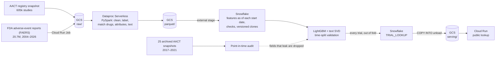

# Clinical Trial Risk Pipeline

Which drug trials will be stopped early? This pipeline ranks every active Phase 1–3 drug trial on ClinicalTrials.gov by its risk of termination, from the registry record, the sponsor's track record before the trial started, and the drug's FDA adverse-event (FAERS) reporting history before the trial started.

**In short.** On 10,242 trials that started in 2015–2016, which the model never saw, it ranks a terminated trial above a completed one 71% of the time (ROC AUC **0.708**, 95% CI 0.696–0.721). Its top-scored 10% terminate at 2.1× the base rate (30.4% vs 14.8%). For termination caused by slow enrollment, the AUC is 0.780. Registry records get edited after trials start, which can leak the outcome into the features. A point-in-time audit rebuilt the registry fields from 25 archived snapshots as they stood at each trial's start. It found that four fields leaked, so the model leaves them out (since v4). Scored with the at-start records, the current model's (v5) AUC does not drop (change +0.003, 95% CI 0.000 to +0.005, 18,568 trials). A competing-risks survival model adds when: for running trials, the chance of termination in the next 2 years, ranked better than the yes/no model at every horizon tested (significantly at 2 years).

**Try it:** [ctrisk-lookup-420431563670.us-east1.run.app](https://ctrisk-lookup-420431563670.us-east1.run.app). Look up any of 111,118 trials by NCT ID, e.g. [NCT00456846](https://ctrisk-lookup-420431563670.us-east1.run.app/trial/NCT00456846): a 2008 breast-cancer trial that was terminated. The model, which never saw its outcome, ranks it riskier than 99% of active trials. JSON: `/api/trials/{nct_id}`.

Full validation report: [`docs/model_card.md`](docs/model_card.md) · Audit: [`docs/audits/2026-10-01-point-in-time.md`](docs/audits/2026-10-01-point-in-time.md) · Dashboard: [`docs/dashboard/index.html`](docs/dashboard/index.html) · Design: [`docs/specs/2026-09-26-design.md`](docs/specs/2026-09-26-design.md)

## How it works



- **Data:** the AACT flat-file snapshot of ClinicalTrials.gov, and the full FAERS history (every quarter 2004–2026: 1,767 files, 118 GB), copied from openFDA into GCS by a Cloud Run Job with 24 parallel tasks in under 4 minutes.
- **GCS:** the data lake, holding the raw AACT tables and FAERS zips, the Spark output, and the published lookup.
- **Spark on Dataproc Serverless:** the same PySpark modules run locally for tests or as serverless batches (`make <job> MODE=cloud`), each with an executor cap and a TTL. The full Spark layer ran on Dataproc for about $1.10 on the FAERS sample; flattening the full FAERS history (20.7 million reports) took 1 h 51 min and $3.46. Snowflake rebuilt from that output is identical to the data v4 was trained on: 111,118 rows, 0 differences. The jobs clean and label the trials and matches each drug to FDA-coded substances (72.0% of labeled trials matched; spot checks against openFDA agree). Also builds per-trial attributes and a registration-text field.
- **Snowflake:** loads the Parquet from GCS. Builds the FAERS and sponsor-history features as of each trial's start date only, with tests that catch planted leakage.
- **Model:** LightGBM on the tabular features plus 64 SVD components of TF-IDF text. Tuned on an inner time split of the training years. Every model is versioned (`models/vN/`) with its metrics, features and the Snowflake clone it was trained on.
- **Serving:** every trial in the modelled population gets a score that never used its own outcome:
  - active trials: the final model
  - trials that started 2015 or later: held out from training
  - 2008–2014 trials: leave-one-start-year-out cross-fitting (their scores average 13.4% vs a 13.9% actual termination rate)

  Snowflake joins the scores to trial details (`TRIAL_LOOKUP`) and unloads them to GCS with `COPY INTO`. A FastAPI app on Cloud Run loads that file at startup, so it scales to zero and never queries Snowflake per visitor. Active-trial scores are also appended to `TRIAL_RISK_SCORES` for the prospective backtest. A one-file dashboard and a model card are generated from the saved metrics.

## Results (model v5: trained on 2008–2014 starts, tested on 2015–2016)

| Target | Test ROC AUC (95% CI) | Logistic baseline | Top-10% precision vs base rate |
|---|---|---|---|
| Any termination | **0.708** (0.696–0.721) | 0.672 | 30.4% vs 14.8% (2.1×) |
| Terminated for enrollment | **0.780** (0.761–0.798) | 0.756 | 16.5% vs 5.1% (3.2×) |
| Terminated for safety | 0.675 (0.618–0.730) | 0.676 | 87 test positives: too few to be conclusive |

**What drives the scores** (mean SHAP contribution on the test set): the registration text, then whether the trial accepts healthy volunteers (No raises risk, Yes lowers it), the sponsor's prior termination rate (high third +0.24, low third −0.18 log-odds), and phase (Phase 2 up, Phase 1 and 3 down). These describe the model, not causes of termination. Text adds +0.012 AUC. Biomedical sentence embeddings (PubMedBERT, 768-d, long texts windowed) were tested in place of and alongside the TF-IDF text and added nothing: 0.699 alone, 0.708 with TF-IDF vs 0.709 for TF-IDF alone; the gain over v4 is not significant (−0.002 to +0.011, paired bootstrap; [experiment](docs/experiments/2026-10-03-text-embeddings.md)). FDA adverse-event (FAERS) history adds nothing measurable, even with the full 20.7 million reports: removing it leaves 0.707 ([experiment](docs/experiments/2026-10-04-full-faers.md)).

**v3 vs v4.** v3 also used criteria count and length, country count and US-only. It scored higher on the test years (0.714, 95% CI 0.700–0.726), but the audit showed those fields had changed after start more often for trials that later terminated. v3 lost 0.005 AUC when scored on the at-start records; v4 loses nothing. v4 trades 0.011 of headline AUC for a number that holds up: those fields carried real signal as well as the leak. **v5** is v4 with the full FAERS history instead of a Q1 sample: equivalent accuracy (v5 minus v4 −0.000 to +0.010, paired bootstrap), but current data: v4's adverse-event features stopped at 2020, so most of today's active trials were scored on frozen counts.

### When, not just whether: a competing-risks survival model

The yes/no model learns only from finished trials and cannot say when a trial will stop. The survival model (M8) does both:
- **Outcomes:** a trial ends terminated or completed (competing events), or is still running at the snapshot (censored), so the ~30,000 running trials inform the model instead of being dropped.
- **Model:** discrete-time hazards, one row per 6-month period a trial was at risk, from LightGBM on the same features and text.
- **Output:** the probability of termination within t years of the start. For a running trial: within the next 2 years, given how long it has already run. That's the number the [lookup](https://ctrisk-lookup-420431563670.us-east1.run.app) shows.

It's evaluated with metrics built for censored data. Time-dependent AUC asks whether trials terminated by t rank above those still running or completed by t, weighted by the inverse probability of censoring:

| Ranking terminations by t (time-AUC) | Within 1 year | Within 2 years (95% CI) | Within 5 years |
|---|---|---|---|
| Survival model, 2015–16 starts | 0.665 | 0.647 (0.629–0.665) | 0.687 |
| Yes/no model v5, same trials | 0.554 | 0.622 | 0.681 |
| Survival model, 2017–20 starts (13% still running) | 0.639 | 0.651 (0.638–0.663) | 0.665 |
| Yes/no model v5, same trials | 0.529 | 0.586 | 0.648 |

The survival model's gain is clear for early terminations: at 2 years it's +0.004 to +0.046 (2015–16) and +0.049 to +0.077 (2017–20), paired bootstrap. Its absolute probabilities run low for later starts (2-year: 5.0% predicted vs 5.7% observed for 2015–16), because the risk itself has moved. Censoring-adjusted termination within 2 years, by start years:

| 2008–10 | 2011–12 | 2013–14 | 2015–16 | 2017–18 | 2019–20 |
|---|---|---|---|---|---|
| 6.3% | 5.2% | 5.1% | 5.7% | 6.0% | **7.4%** |

Termination fell through the early 2010s and has risen since: trials that started in 2019–20 (the COVID era) were terminated within 2 years about 45% more often than 2013–14 starts. The binary approach could not measure this, because it cannot adjust for trials still running. Details: [`docs/survival_card.md`](docs/survival_card.md).

## Why the number can be trusted

- **Time split, untouched test years.** Trained on 2008–2014 starts and tested on 2015–2016. Tuning and text fitting never see the test rows, and `tests/test_ml_train.py` pins both.
- **Point-in-time audit.** For 18,568 trials that started in 2017–2020, the registry fields were rebuilt from AACT archives as each record stood at its start, and the model was scored both ways on the same trials. v5: 0.692 → 0.695 (+0.003, 95% CI 0.000 to +0.005). The 9,112 trials whose archived record predates the start give +0.004 (−0.000 to +0.008). Nine format changes between old and current exports were harmonized first, each with a test. ([audit note](docs/audits/2026-10-01-point-in-time.md))
- **Not a lucky window.** In rolling-origin tests, each window trained only on earlier starts: 0.713 (2012–13), 0.731 (2013–14), 0.702 (2014–15), 0.708 (2015–16).
- **Calibration.** Brier 0.118 on the test set. Calibration slope 0.94 (scores slightly more extreme than outcomes) and intercept 0.12 (risk slightly under-predicted overall).
- **Leakage found and removed along the way:**
  - outcome measures rewritten when results were posted
  - termination wording in summaries
  - negated stop reasons ("no safety concerns")
  - a sponsor feature that skewed at scoring time (all four before v2)
  - the four post-start fields above (v4)
  - impossible FAERS report dates (year 0001) that broke the full-history build (v5)

### Validation summary

| | Train | Test | Recent |
|---|---|---|---|
| Start years | 2008–2014 | 2015–2016 | 2017–2020 |
| Trials | 36,286 | 10,242 | 19,596 |
| Terminated | 5,055 (13.9%) | 1,513 (14.8%) | 3,658 (18.7%) |
| Use | fit; tuned on <2013 vs 2013–2014 | headline metrics, calibration | audit; censored (see below) |

- **Outcome:** `overall_status = TERMINATED` (1) vs `COMPLETED` (0). Withdrawn, suspended, unknown-status and still-running trials carry no label. Recent starts over-represent early terminations, because terminated trials finish sooner. Their AUC is 0.701, close to the test years.
- **Text model:** TF-IDF over word 1–2grams (min_df 20, at most 50k terms), TruncatedSVD to 64 components, fit on training rows only.
- **Missing data:** LightGBM's native handling. The logistic baseline uses median imputation plus missing indicators.
- **By subgroup (test AUC):**
  - sponsor: industry 0.742, academic/other 0.655, government 0.658
  - phase: Phase 1 0.743, Phase 1/2 0.664, Phase 2 0.671, Phase 2/3 0.671, Phase 3 0.699
  - start year: 2015 0.694, 2016 0.724
- **Per-trial contributors:** `TOP_DRIVER_1..3` in `TRIAL_RISK_SCORES` read `feature=value` with a signed log-odds contribution, e.g. `healthy_volunteers=No` (+0.20) for NCT03801083. v2 rows keep bare feature names; `MODEL_VERSION` tells them apart.
- **Prospective backtest:** `make backtest` joins earlier scores with outcomes known now. The baseline is `models/backtest_2026-10-01.json`; nothing has resolved yet. Re-run yearly.

## Limitations

- The training and test years (2008–2016) predate the AACT archives, so the audit covers 2017–2020 starts. The 2015–2016 headline relies on the same edit patterns holding there.
- The archives lack the MeSH hierarchy, so the 14 disease-area flags were not audited.
- Stop reasons come from free text, and safety labels are about 70–80% precise.
- Planned enrollment is excluded because the current record already reflects the outcome.
- FAERS features are a historical reporting signal, not a measure of drug safety. FAERS has duplicate and incomplete reports and cannot establish causation or incidence (FDA). Even the full 2004–2026 history adds nothing measurable to these models.
- The risk percentages are calibrated on the 2015–2016 cohort only. Use them as rankings.

## Data

AACT snapshot of 2026-09-26 (604,561 registered studies):

| | |
|---|---|
| Phase 1–3 drug trials, started 2008 or later, completed or terminated | 81,224 (66,124 started before 2021 and used for modelling) |
| Termination rate (modelled trials) | 15.5% |
| Active, scored | 29,894 |
| Drug/biologic interventions to match against FAERS (M1 population) | 208,568 (80,199 distinct names) |

FAERS, the full openFDA drug/event history (every quarter 2004–2026; 1,767 files, 118 GB zipped), flattened on Dataproc:

| | Full history (v5) | Q1 sample (until v4) |
|---|---|---|
| Reports (latest version each) | 20,685,981 | 3,247,112 |
| Report × substance rows | 73.1M | 11.9M |
| Match vocabulary (FDA-coded substances) | 13,707 | 7,795 |
| Labeled trials matched to ≥1 substance | 47,596 of 66,124 (72.0%) | 44,222 (66.9%) |
| API spot-check (2016 Q1, ours vs openFDA) | ondansetron, metformin, atorvastatin, adalimumab: all 1.00 | same |
| Random sample of 30 matches | | 30 correct |

Unmatched trials are mostly investigational compounds with no marketing history (e.g. "BI 10773"), drugs never sold in the US, placebos, and non-drug interventions.

## Dashboard

[`docs/dashboard/index.html`](docs/dashboard/index.html) is built by `make dashboard` from two Snowflake views (`VW_ACTIVE_TRIAL_RISK`, `VW_RISK_BY_AREA`) and the latest model's metrics. It shows:
- held-out performance with confidence intervals
- calibration
- what each feature group adds
- the riskiest active trials, with filters and their main model contributors

It is one self-contained file: open it locally or serve `docs/` with GitHub Pages.

## Run

```bash
make setup
make ingest-aact AACT=<aact-flat-files.zip>   # from https://aact.ctti-clinicaltrials.org/snapshots
make ingest-faers                             # FAERS sample set in .env (default: Q1 2004-2020, 14.9 GB)
make trials                                   # -> data/parquet/trials, drug_interventions
make faers                                    # -> data/parquet/faers_drug_events
make match                                    # -> data/parquet/trial_drug_map
make check-faers                              # our counts vs the openFDA API
make attributes                               # -> data/parquet/trial_attributes
make text                                     # -> data/parquet/trial_text
make upload                                   # data/parquet -> gs://$GCP_BUCKET/parquet
make warehouse                                # Snowflake: RAW_* -> TRIAL_FEATURES, then checks
make train                                    # clone TRIAL_FEATURES, fit, save models/vN
make score                                    # overall + enrollment risk for active trials -> TRIAL_RISK_SCORES
make dashboard                                # Snowflake serving views -> docs/dashboard/index.html
make audit-build                              # M6: registry features from archived AACT snapshots (AACT_ARCHIVES in .env; see the audit note for how to get them)
make audit                                    # M6: latest-record vs point-in-time AUC on 2017-2020 starts
make backtest                                 # scores written earlier vs outcomes known now
make report                                   # docs/model_card.md: the full validation report for the latest model
make m6                                       # all of the above from trials onward, plus the audit if AACT_ARCHIVES is set
make survival                                 # competing-risks survival model -> models/survival/vN/
make lookup                                   # every trial scored without its own outcome -> TRIAL_LOOKUP_SCORES
make publish                                  # Snowflake unloads TRIAL_LOOKUP to gs://$GCP_BUCKET/serving/
make deploy                                   # the public lookup app on Cloud Run
make test
```

Cloud mode (after the one-time `sql/01_serving_setup.sql` in Snowsight and `scripts/gcp_setup.sh`):

```bash
make upload-raw                               # raw AACT tables and FAERS zips -> gs://$GCP_BUCKET/raw/
make ingest-faers-cloud                       # the full FAERS history, openFDA -> GCS by a Cloud Run Job (~4 min)
make trials MODE=cloud DRY_RUN=1              # print the Dataproc batch and its worst-case cost
make trials faers match attributes text MODE=cloud   # the Spark jobs on Dataproc Serverless, writing to GCS
make faers MODE=cloud FAERS_RAW=raw/faers_full DATAPROC_MAX_EXECUTORS=7 DATAPROC_TTL=6h   # full history (~2 h, ~$3.50)
```

## Snowflake setup (once)

```bash
mkdir -p ~/.snowflake && openssl genrsa 2048 | openssl pkcs8 -topk8 -inform PEM -out ~/.snowflake/rsa_key.p8 -nocrypt && chmod 600 ~/.snowflake/rsa_key.p8
openssl rsa -in ~/.snowflake/rsa_key.p8 -pubout | grep -v -- '-----' | tr -d '\n'
```

In Snowsight: `ALTER USER <your user> SET RSA_PUBLIC_KEY='<the printed key>';`

Then run `sql/00_setup.sql` in Snowsight (as `ACCOUNTADMIN`, top to bottom), copy `STORAGE_GCP_SERVICE_ACCOUNT` from its `DESC STORAGE INTEGRATION` output, and grant that service account `roles/storage.objectViewer` on the bucket:

```bash
gcloud storage buckets add-iam-policy-binding gs://$GCP_BUCKET \
  --member="serviceAccount:<STORAGE_GCP_SERVICE_ACCOUNT>" --role=roles/storage.objectViewer
```

Fill in the Snowflake block in `.env` (see `.env.example`).
